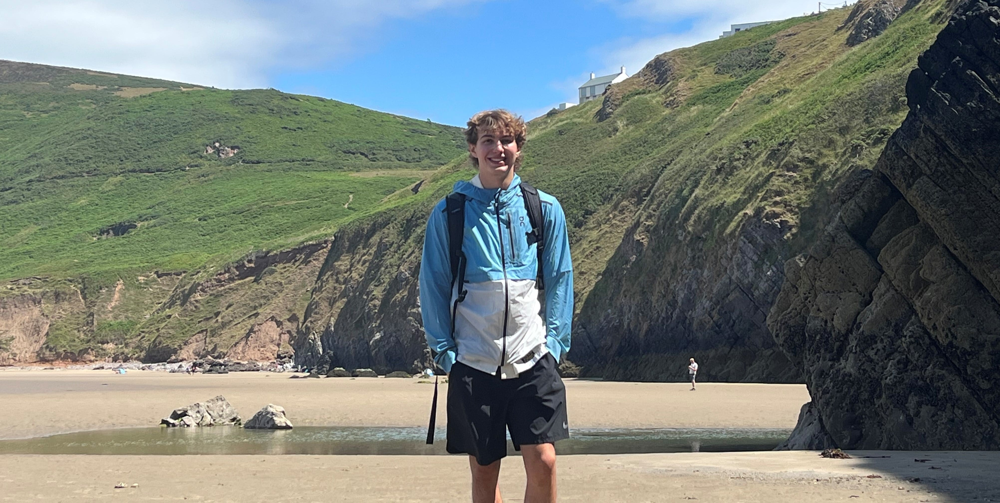

# Wales Study Abroad 2022!

I had an unbeleivable time in the UK studying computer architecture this summer. The classes were held at Swansea University, and taught by A&M professors.

 I already find myself missing the "tube", full englishes, watching rugby in the pubs, and Tesco. Hopefully Ill return to the beaches of Rhosilli sooner than later, but til then, I can enjoy the friendships I made on my adventure. 

For our weekend trips, we went to

- Cardiff, Capital of Wales

- Snowdonia to hike mount Snowden

- Cambridge, where we visited the ARM headquarters

- london, Eagles concert at Hyde Park

- LOTS and lots of castles

The classes I took were ECEN 350, computer architecture, and ECEN 469, advanced computer architecture. I learned how to design an ARM V8 CPU from scratch, along with the memory hiearchy and assembly that comes with that. The small class size and 2 professors for lab was amazing.

Whats Next?

Now that I know the high level(C++) and the low level(computer architecture) of a computer, I want to learn the middle level(OS and compile) to get a complete understanding. This Fall semester Im taking CSCE 313 to help with this, but Im always learning on my own as well.
 
[Back to Home](/README.md)
